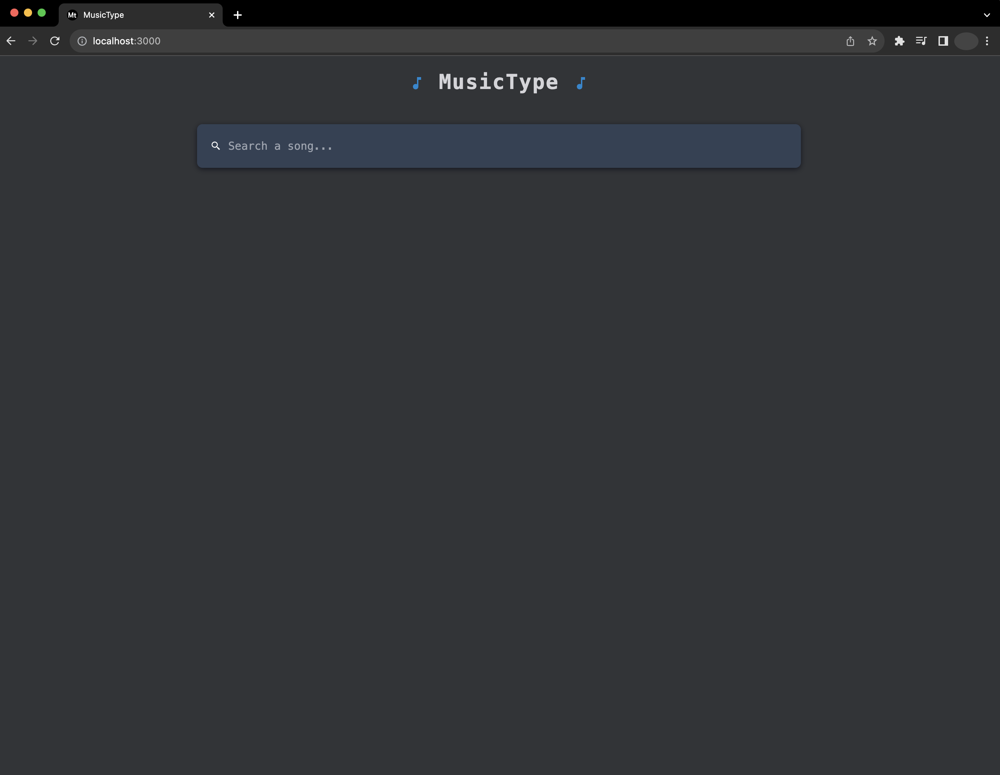
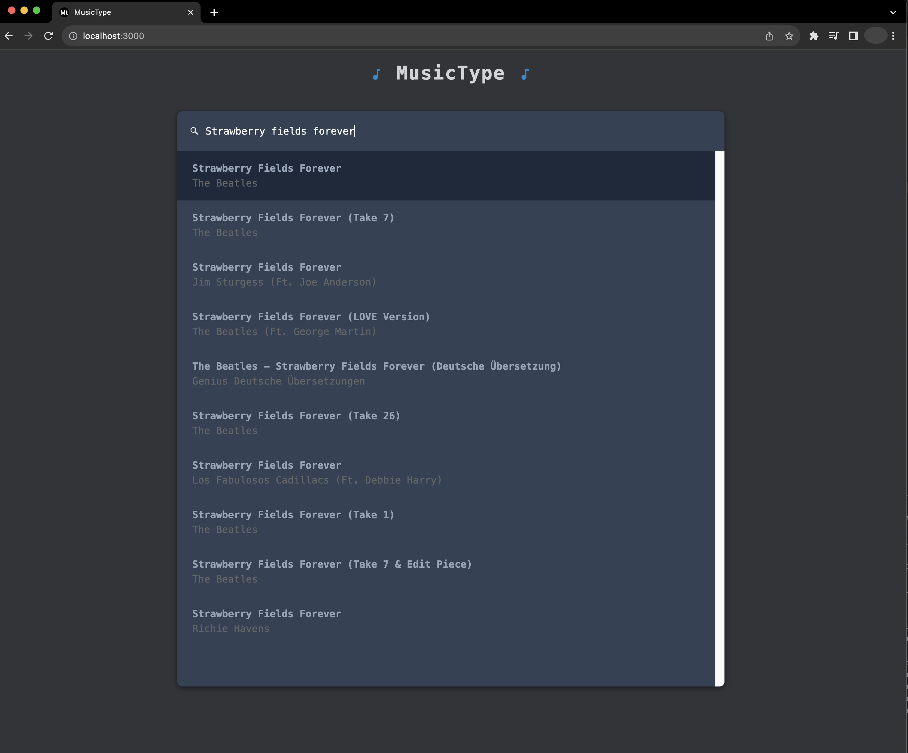
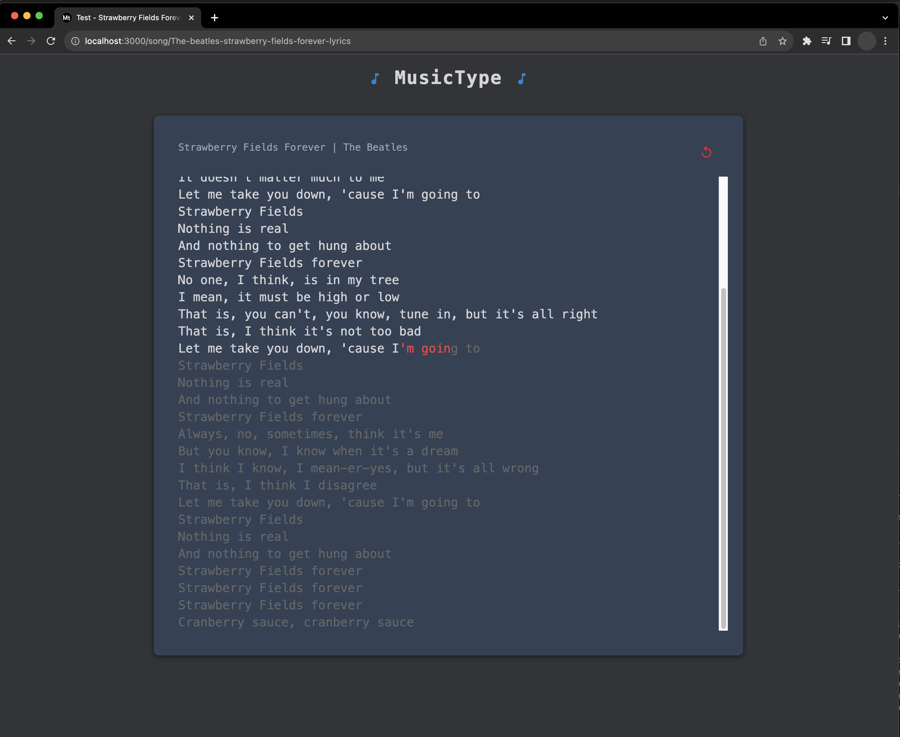

# MusicType

Typing tests with music lyrics.

You can find all song lyrics that are available in [genius.com](https://genius.com/). The lyrics are scraped just in time.

This app is minimalistic, has no timers and does not measure typing speed. **Just enjoy listening to and typing the lyrics of your favorite songs.**







# Tutorial to use MusicType locally:

## Requirements:

- Python (3.11.1)
- Poetry (package manager)
- Node (v20.5.0)
- Yarn (package manager)

Probably other versions of Python and Node work perfectly fine with this project.

## Install and run backend:

```shell
cd musictype
poetry install
echo 'APP_ENV=dev'>>.env
poetry run python backend/main.py
```

## Install and run frontend:

```shell
cd frontend
yarn install
yarn dev
```

Now opening http://localhost:3000/ in any web browser will display the app. (I use Chrome)

**Enjoy!**
